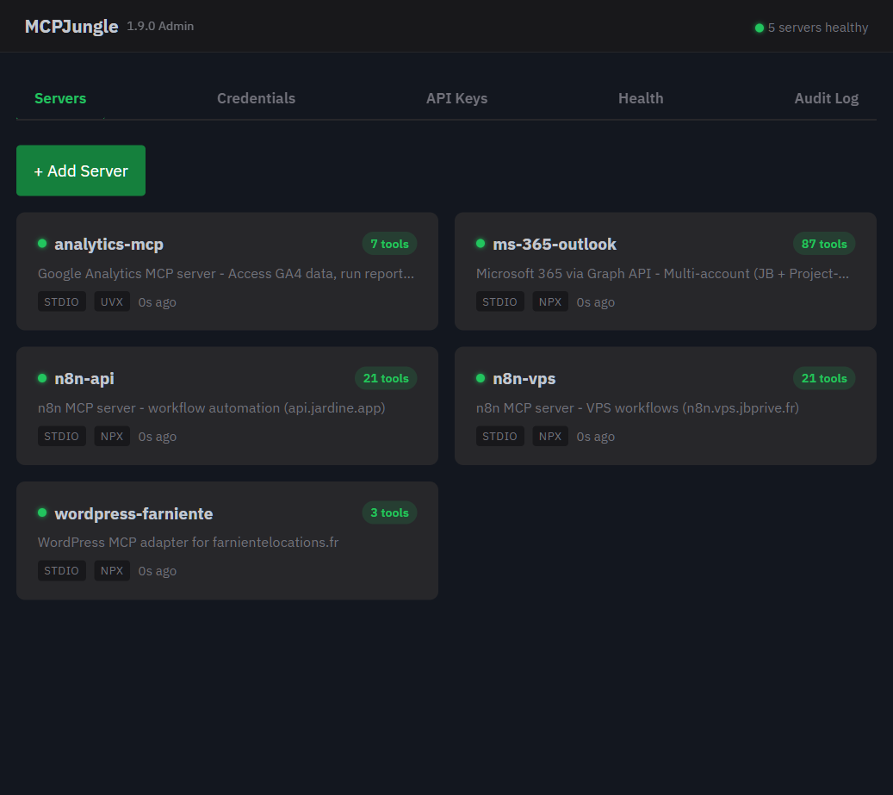
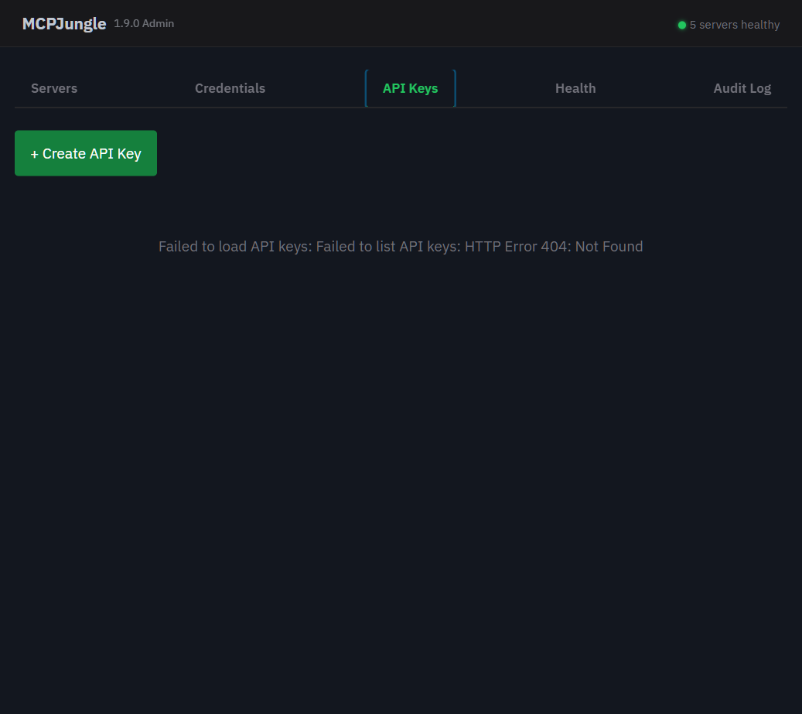

# MCPJungle for Cloudron

[](https://github.com/jbjardine/mcpjungle-cloudron/releases)
[](https://github.com/jbjardine/mcpjungle-cloudron/pkgs/container/mcpjungle-cloudron)
[](https://www.cloudron.io/)
[](LICENSE)
[](https://www.buymeacoffee.com/jbjardine)

**Self-hosted MCP Gateway for Cloudron.** Register any number of MCP servers and access them all from Claude Code, Cursor, Windsurf, or any MCP client through a single authenticated HTTPS endpoint.

<p align="center">
  
</p>

---

## Features

- **One endpoint, all servers** - register unlimited MCP servers behind a single URL with Bearer token auth
- **Web dashboard** - manage servers, API keys, credentials, and health from a modern dark-theme UI
- **Enable/disable servers** - toggle individual servers on and off from the dashboard
- **Bridge port** - expose any MCP server as an HTTP endpoint at `/bridge/<name>/`
- **Auto-install** - npm and uvx packages install automatically when you add a server
- **Deferred boot** - servers register in the background so the dashboard is available in ~7 seconds
- **Circuit breaker** - unhealthy registrations are skipped after repeated failures
- **Managed lifecycle** - install, update, edit settings, remove, and reconcile servers with `mcpjungle-admin`
- **Cloudron-native** - PostgreSQL for config, local storage for credentials, SSO for dashboard access
- **Streamable HTTP** - modern MCP transport with session management

## Quick Start

### 1. Install on Cloudron

**Option A - Custom App Store (recommended)**

Add MCPJungle to your Cloudron app store for one-click install and automatic updates:

1. Go to your Cloudron dashboard → **App Store** → **Settings**
2. Add this URL as a custom app store:
   ```
   https://raw.githubusercontent.com/jbjardine/mcpjungle-cloudron/main/CloudronVersions.json
   ```
3. MCPJungle appears in your app store → click **Install**

**Option B - CLI**

```bash
cloudron install --image ghcr.io/jbjardine/mcpjungle-cloudron:latest
```

### 2. Initialize

SSH into the container (`cloudron exec`) and run:

```bash
mcpjungle init-server
```

Then create an API key from the dashboard (API Keys tab) or via CLI:

```bash
mcpjungle create mcp-client my-key
# -> save the Bearer token
```

### 3. Add MCP servers

Use the dashboard at `https://<your-domain>/admin` or the CLI:

```bash
# npm package
mcpjungle-admin install --type npm_package \
  --name my-server --package @org/mcp-server

# uvx package
mcpjungle-admin install --type uvx_package \
  --name my-uvx-server --package some-uvx-mcp

# remote HTTP
mcpjungle-admin install --type http_remote \
  --name remote-mcp --url http://192.168.1.10:3000/mcp
```

### 4. Connect your AI client

See [Client Configuration](#client-configuration) below.

## Dashboard

The admin dashboard is available at `https://<your-domain>/admin`, protected by Cloudron SSO.

<p align="center">
  
</p>

From the dashboard you can:

- **Add / remove** MCP servers with automatic package installation
- **Enable / disable** servers with a toggle switch
- **Manage credentials** - set or update environment variables and secrets per server
- **Create / revoke API keys** for MCP client authentication
- **View health status** of all registered servers in real time
- **Browse the audit log** of all admin mutations

## Client Configuration

### Claude Code

Add to your project's `.mcp.json`:

```json
{
  "mcpServers": {
    "mcpjungle": {
      "type": "streamable-http",
      "url": "https://mcpjungle.example.com/mcp",
      "headers": {
        "Authorization": "Bearer YOUR_API_KEY"
      }
    }
  }
}
```

### Claude Desktop

Add to `claude_desktop_config.json`:

```json
{
  "mcpServers": {
    "mcpjungle": {
      "transport": "streamable-http",
      "url": "https://mcpjungle.example.com/mcp",
      "headers": {
        "Authorization": "Bearer YOUR_API_KEY"
      }
    }
  }
}
```

### Cursor / Windsurf

Add to your MCP settings (Settings > MCP Servers):

| Field | Value |
|-------|-------|
| Name | `mcpjungle` |
| Type | `streamable-http` |
| URL | `https://mcpjungle.example.com/mcp` |
| Header | `Authorization: Bearer YOUR_API_KEY` |

## Bridge Port (Exposing MCP URLs)

Any MCP server can expose its own HTTP endpoint. Set a bridge port in the server settings and MCPJungle creates an nginx reverse proxy automatically:

```
https://mcpjungle.example.com/bridge/<server-name>/
```

This is useful for MCP servers that also serve a web UI or API alongside their MCP transport (e.g., n8n-mcp, database dashboards).

Configure the bridge port from the dashboard when adding or editing a server, or remove and re-add the server with the new port.

## Server Management

### List servers

```bash
mcpjungle-admin list-managed
```

### Update a server

```bash
# Pin to a specific version
mcpjungle-admin update my-server --to 2.0.0

# Resolve and pin the latest version
mcpjungle-admin update my-server
```

### Manage credentials

Set or update environment variables for a server:

```bash
mcpjungle-admin creds-set my-server API_KEY=sk-new-key
mcpjungle-admin creds-list my-server
```

You can also manage credentials from the dashboard (Credentials tab).

### Bind file-backed secrets

```bash
mcpjungle-admin bind-file \
  --name my-server \
  --source /app/data/imports/secret.json \
  --env-key SECRET_FILE
```

### Remove a server

```bash
mcpjungle-admin remove my-server
```

### Health check

```bash
mcpjungle-admin doctor
```

### Force reconcile

```bash
mcpjungle-admin reconcile --name my-server --force
```

## Architecture

```
Claude Code / Cursor / Windsurf
           |
           v
  https://mcpjungle.example.com/mcp    (Bearer token)
           |
           v
  +-------------------+
  | nginx :8080       |  reverse proxy, rate limiting
  +--------+----------+
           |
     +-----+------+
     |            |
     v            v
  MCPJungle    Admin API
  :8081 (Go)   :8082 (Python)
     |
  +--+--+--+
  |  |  |  |
  v  v  v  v
 MCP servers (npm, uvx, http, custom)
```

Three processes run inside a single Cloudron container, managed by supervisord:

| Process | Port | Role |
|---------|------|------|
| nginx | 8080 (external) | Reverse proxy, TLS termination, bridge routing |
| mcpjungle | 8081 (internal) | MCP gateway (Go binary, Enterprise mode) |
| admin-api | 8082 (internal) | Python REST API for dashboard and CLI |

## Managed Types

| Type | Description |
|------|-------------|
| `npm_package` | npm-installed MCP server, pinned version, isolated `node_modules` |
| `uvx_package` | Python uvx-installed MCP server, pinned version, isolated venv |
| `http_remote` | Remote HTTP MCP endpoint (no local binary) |
| `local_bundle` | Pre-built MCP server in `/app/data/mcp-bundles/<name>/` |
| `custom_command` | Arbitrary command-line MCP server |

## Managed vs. Manual Servers

**Managed servers** are tracked in `/app/data/.mcpjungle-managed/registry.json` and reapplied automatically after Cloudron restarts or image upgrades.

**Manual servers** registered directly with `mcpjungle register --conf ...` still work. The reconciler does not touch them unless you import them with `mcpjungle-admin import-existing --all`.

## Build and Deploy

```bash
# Build
cloudron build

# Install
cloudron install --image <tag>

# Update
cloudron update --app mcpjungle.example.com --image <tag>
```

Docker images are published to GHCR on every release:

```
ghcr.io/jbjardine/mcpjungle-cloudron:<tag>
ghcr.io/jbjardine/mcpjungle-cloudron:latest
```

## Requirements

- Cloudron 9.1.0+
- PostgreSQL addon (provisioned automatically)
- Local storage addon (provisioned automatically)

## Contributing

PRs are welcome. See [CONTRIBUTING.md](CONTRIBUTING.md) for development setup and guidelines.

## Security

See [SECURITY.md](SECURITY.md) for the security model, known limitations, and how to report vulnerabilities.

## License

MIT. See [LICENSE](LICENSE).

## Credits

Built on top of [MCPJungle](https://github.com/mcpjungle/mcpjungle).
